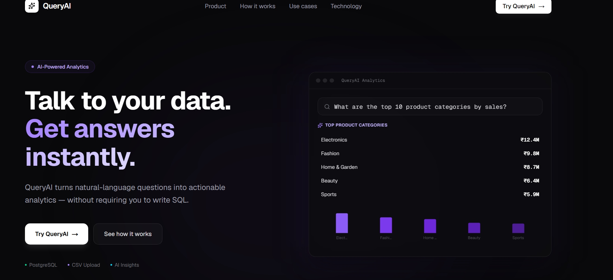
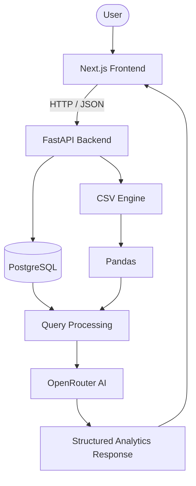
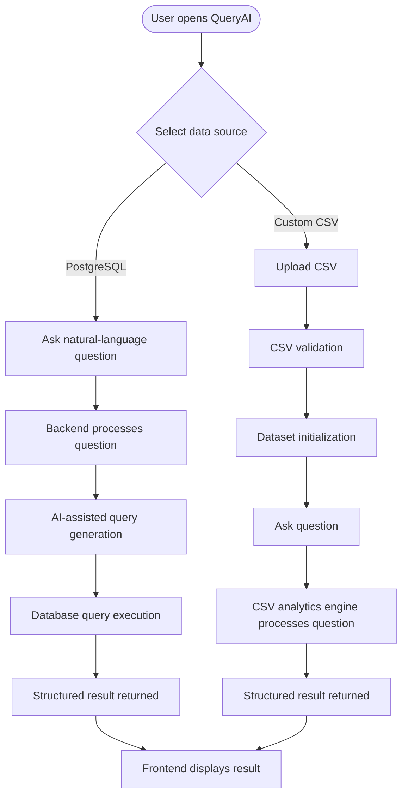

# QueryAI

**AI-Powered Natural Language Analytics for SQL Databases and CSV Data**


QueryAI lets users interact with structured data using plain English instead of writing SQL. Ask a question, get a structured, visualized answer — whether your data lives in a PostgreSQL database or a CSV file you just uploaded.



---

## Table of Contents

1. [Demo](#demo)
2. [Problem](#problem)
3. [Solution](#solution)
4. [Key Features](#key-features)
5. [Architecture](#architecture)
6. [How It Works](#how-it-works)
7. [PostgreSQL Workflow](#postgresql-workflow)
8. [CSV Workflow](#csv-workflow)
9. [Technology Stack](#technology-stack)
10. [Project Structure](#project-structure)
11. [API Documentation](#api-documentation)
12. [API Examples](#api-examples)
13. [Local Development](#local-development)
14. [Environment Variables](#environment-variables)
15. [Deployment](#deployment)
16. [Industry Potential](#industry-potential)
17. [Use Cases](#use-cases)
18. [Roadmap](#roadmap)
19. [Technical Highlights](#technical-highlights)
20. [Known Limitations](#known-limitations)
21. [Contributing](#contributing)
22. [License](#license)
23. [Author](#author)

---

## Demo

| | |
|---|---|
| **Live Frontend** | [QueryAI Frontend](YOUR_VERCEL_URL) |
| **Backend API** | [QueryAI API](YOUR_RENDER_URL) |
| **API Documentation (Swagger)** | [API Docs](YOUR_RENDER_URL/docs) |
| **GitHub Repository** | [QueryAI Repository](YOUR_GITHUB_URL) |

> Screenshots of the interface (question interface, AI insights, and visualizations) can be added here.

---

## Problem

Traditional data analytics usually requires users to:

- Understand SQL
- Know the underlying database schema
- Depend on data analysts for every new question
- Manually construct queries
- Repeatedly request the same types of reports

This creates a bottleneck between the people who have questions about the data and the people who know how to query it.

## Solution

QueryAI removes this barrier by allowing users to ask questions about their data in natural language. The backend interprets the question, generates the appropriate query, executes it against the selected data source, and returns a structured, explainable result — without the user needing to write a single line of SQL.

---

## Key Features

| Feature | Description |
|---|---|
| Natural-language querying | Ask questions in plain English against PostgreSQL or CSV data |
| PostgreSQL analytics | Query a connected PostgreSQL database conversationally |
| CSV analytics | Upload a CSV and query it the same way |
| AI-assisted query processing | Natural-language questions are translated into an analytics workflow via OpenRouter |
| CSV validation & parsing | Uploaded files are validated and parsed before use |
| Dataset identification | Each uploaded CSV receives a unique dataset ID for subsequent queries |
| Structured API responses | Consistent JSON responses containing SQL, answer, data, and summary |
| Analytics summaries | Responses include a summary alongside raw data |
| Visualization metadata | Responses include metadata used to render charts on the frontend |
| REST API | Clean, versioned FastAPI endpoints |
| Swagger / OpenAPI docs | Auto-generated interactive API documentation |
| Modern Next.js interface | Responsive UI with query history, suggested questions, and system status |
| Environment-based configuration | Secrets and connection details are never hardcoded |
| Error handling | Structured HTTP error responses for invalid input and failures |
| Deployment-ready architecture | Frontend and backend are deployed independently |

> QueryAI does **not** currently include authentication, multi-user collaboration, real-time streaming, permanent CSV storage, predictive analytics, or automatic dashboards. These are tracked in the [Roadmap](#roadmap).

---

## Architecture



---

## How It Works



---

## PostgreSQL Workflow

1. User selects **PostgreSQL** mode in the frontend.
2. User asks a natural-language question (e.g. *"Which payment method is most popular?"*).
3. The question is sent to `POST /query`.
4. The backend's query engine processes the question with AI assistance and executes it against PostgreSQL via SQLAlchemy.
5. A structured JSON response — including SQL, answer, data, and visualization metadata — is returned to the frontend.

## CSV Workflow

```
User uploads CSV
        ↓
CSV validation
        ↓
CSV parsing
        ↓
Dataset ID generation
        ↓
Dataset initialization
        ↓
Natural-language question
        ↓
CSV analytics engine
        ↓
Structured response
        ↓
Frontend visualization
```

1. User uploads a CSV file via `POST /csv/upload`.
2. The file is validated and parsed, and metadata (filename, row/column counts, schema) is extracted.
3. A unique `dataset_id` is generated and the dataset is initialized in memory.
4. The user asks a question about the dataset via `POST /csv/query`, passing the `dataset_id`.
5. The CSV analytics engine (built on Pandas) processes the question and returns a structured response.

---

## Technology Stack

### Backend

| Technology | Purpose |
|---|---|
| Python | Core backend language |
| FastAPI | REST API framework |
| SQLAlchemy | Database connection and abstraction |
| PostgreSQL | Primary relational database |
| psycopg2 | PostgreSQL driver |
| Pandas | CSV parsing and analytics |
| Pydantic | Request/response validation |
| python-dotenv | Environment variable management |

### AI

| Technology | Purpose |
|---|---|
| OpenRouter API | Natural-language query processing |
| Configurable model | Model selectable via environment variable |

### Frontend

| Technology | Purpose |
|---|---|
| Next.js | React framework for the UI |
| React | Component-based UI |
| TypeScript | Type-safe frontend development |

### Deployment

| Component | Platform |
|---|---|
| Frontend | Vercel |
| Backend | Render |
| Database | PostgreSQL |

---

## Project Structure

```
Query-AI/
│
├── frontend/
│   ├── app/
│   ├── components/
│   ├── public/
│   ├── package.json
│   └── ...
│
├── src/
│   ├── database.py        # SQLAlchemy / PostgreSQL connection
│   ├── query_engine.py    # Natural-language query processing (PostgreSQL)
│   ├── csv_parser.py      # CSV validation and parsing
│   ├── csv_engine.py      # CSV analytics/query processing
│   └── ...
│
├── requirements.txt
├── .env.example
├── .gitignore
└── README.md
```

---

## API Documentation

FastAPI automatically generates interactive API documentation:

- **Swagger UI:** `/docs`
- **OpenAPI schema:** `/openapi.json`

These can be used to explore and test every endpoint directly from the browser once the backend is running.

### Endpoints

| Method | Endpoint | Description |
|---|---|---|
| `GET` | `/` | Basic API information |
| `GET` | `/health` | Backend health status |
| `POST` | `/query` | Ask a natural-language question against PostgreSQL |
| `POST` | `/csv/upload` | Upload and initialize a CSV dataset |
| `POST` | `/csv/query` | Ask a natural-language question against an uploaded CSV dataset |

---

## API Examples

### `POST /query`

**Request**

```json
{
  "question": "What are the top 10 product categories by total sales?"
}
```

### `POST /csv/upload`

**Response**

```json
{
  "dataset_id": "ad810cec8c32",
  "filename": "sales.csv",
  "rows": 1000,
  "columns": 8,
  "schema": [...]
}
```

### `POST /csv/query`

**Request**

```json
{
  "question": "What are the total sales by product category?",
  "dataset_id": "ad810cec8c32"
}
```

**Response**

```json
{
  "question": "...",
  "source": "csv",
  "dataset_id": "...",
  "sql": "...",
  "answer": "...",
  "columns": [...],
  "data": [...],
  "summary": {...},
  "visualization": {...}
}
```

### End-to-End Example

```
Natural language
        ↓
   QueryAI
        ↓
Query processing
        ↓
Database / dataset
        ↓
Analytics result
        ↓
Structured response
```

A user asks: *"What are the top 10 product categories by total sales?"*

**Illustrative response** (values shown are placeholders, not actual results):

```json
{
  "question": "What are the top 10 product categories by total sales?",
  "source": "postgresql",
  "sql": "...",
  "answer": "...",
  "columns": [...],
  "data": [...],
  "summary": {...},
  "visualization": {...}
}
```

---

## Local Development

### Backend

```bash
# Create a virtual environment
python -m venv .venv

# Activate (Windows)
.\.venv\Scripts\Activate.ps1

# Install dependencies
pip install -r requirements.txt

# Run the backend (example)
uvicorn src.main:app --reload
```

### Frontend

```bash
cd frontend

npm install

npm run dev
```

**Production build:**

```bash
npm run build
```

The frontend must be configured with the backend's URL via an environment variable (see below), and the frontend source must reference the matching variable name.

---

## Environment Variables

Create a `.env` file based on the following structure. **Never commit `.env` files to Git.**

```env
# Database
DB_USER=
DB_PASSWORD=
DB_HOST=
DB_PORT=5432
DB_NAME=

# AI
OPENROUTER_API_KEY=
OPENROUTER_MODEL=

# CORS
CORS_ORIGINS=
```

For deployed environments, `DATABASE_URL` may be used where applicable instead of the individual `DB_*` variables, depending on the hosting provider's configuration.

**Frontend:**

```env
NEXT_PUBLIC_API_URL=<your-backend-url>
```

The frontend code must use a variable name matching whatever is actually defined in the project.

---

## Deployment

- **Frontend:** Deployed on Vercel. The Next.js production build (`npm run build`) currently completes successfully.
- **Backend:** Deployed on Render, exposing the FastAPI application along with its Swagger/OpenAPI interface.

Example response from the deployed root endpoint:

```json
{
  "name": "QueryAI",
  "status": "running",
  "message": "Natural language analytics API"
}
```

### Known Deployment Status

The backend deployment on Render is currently experiencing an infrastructure/stability issue that can intermittently result in `502 Bad Gateway` responses or temporary service unavailability. The application architecture and frontend deployment are fully in place; backend deployment stability is actively being resolved. See [Known Limitations](#known-limitations) for details.

---

## Industry Potential

QueryAI's core concept — a natural-language interface over structured business data — has applications well beyond a single demo dataset. The long-term value is not simply "AI generating SQL"; it is giving non-technical users a way to explore data and reach actionable insights without depending on a data analyst for every question.

Potential application areas include:

1. E-commerce analytics
2. Sales analytics
3. Marketing analytics
4. Financial reporting
5. Operations analytics
6. Customer analytics
7. Supply-chain analytics
8. Business intelligence

### Use Cases

| Role | Example Question |
|---|---|
| E-commerce manager | "Which categories generated the highest revenue this month?" |
| Sales manager | "Which regions are underperforming?" |
| Operations manager | "Which orders had the longest delivery times?" |
| Business owner | "What are my top-selling products?" |

This pattern is broadly relevant to business users, data analysts, developers, operations teams, startups, small businesses, and e-commerce teams who need fast answers from their data without writing queries themselves.

---

## Roadmap

The following are **planned** future phases and are not part of the current implementation.

**Phase 1 — Stabilization**
- Stabilize production deployment
- Improve PostgreSQL query reliability
- Improve CSV query reliability
- Better error messages
- Improve frontend result rendering

**Phase 2 — User Experience**
- Authentication
- User workspaces
- Persistent datasets
- Saved queries
- Query history
- Dashboard creation
- More visualization types

**Phase 3 — Data Connectors**
- Additional database connectors: MySQL, SQLite
- Data warehouse support: Snowflake, BigQuery

**Phase 4 — Enterprise Readiness**
- Enterprise security
- Role-based access control
- Audit logs
- Team collaboration
- Organization workspaces

**Phase 5 — Advanced Analytics**
- Automated insights
- Anomaly detection
- Forecasting
- Scheduled reports
- AI-generated business summaries

---

## Technical Highlights

- **FastAPI** for a high-performance, async-capable API layer with automatic OpenAPI documentation.
- **Pydantic** models enforce request and response validation at the API boundary.
- **SQLAlchemy** provides a database abstraction layer over PostgreSQL, keeping connection logic decoupled from query logic.
- **Pandas** powers CSV parsing and in-memory analytics for uploaded datasets.
- **Modular backend architecture** separates database access, PostgreSQL query processing, CSV parsing, and CSV query processing into distinct components.
- **RESTful, structured JSON responses** keep the API contract consistent across PostgreSQL and CSV query paths.
- **Environment-based configuration** keeps credentials, API keys, and CORS settings out of source code.
- **Next.js frontend** deployed independently from the backend, communicating over HTTP/JSON.
- **OpenRouter integration** allows the underlying AI model to be swapped via configuration rather than code changes.

---

## Known Limitations

QueryAI is under active development. Current engineering boundaries include:

- Render's free-tier/service behavior can cause cold starts or temporary availability issues.
- Backend deployment stability is still being resolved (see [Deployment](#deployment)).
- CSV datasets are currently initialized in memory rather than persisted permanently.
- Query understanding can fail for questions that do not map cleanly to the available schema or data.
- Authentication and multi-user isolation are not currently implemented.
- Advanced analytics capabilities (forecasting, anomaly detection, automated insights) are planned (see [Roadmap](#roadmap)) but not currently available.

These are treated as current engineering boundaries and roadmap opportunities rather than defects.

---

## Contributing

Contributions, issues, and feature suggestions are welcome. If you'd like to contribute, please open an issue to discuss the proposed change before submitting a pull request.

---

## License

License information will be added to the repository.

---

## Author

**Gururaj Sharma**
B.Tech Computer Science & Engineering

- GitHub: [GitHub Profile](YOUR_GITHUB_PROFILE)
- LinkedIn: [LinkedIn](YOUR_LINKEDIN)
